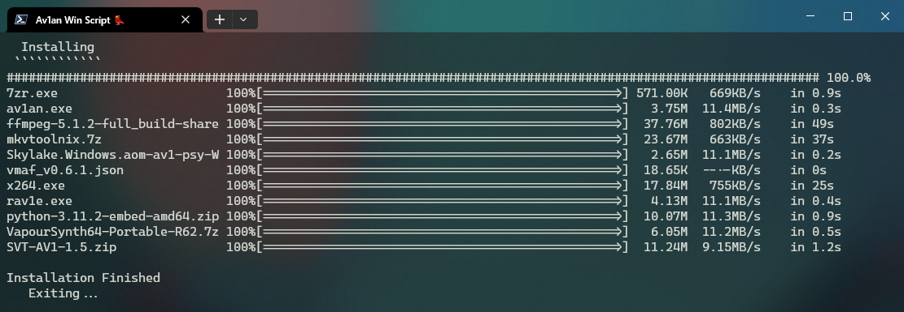

#  ⚙ Av1an Win Script

A Windows Batch script that sets up [Av1an](https://github.com/master-of-zen/Av1an) with all its dependencies in a portable workspace. It doesnt require building from source or modifying any path variables. Once installed, It will queue your input files to be encoded one by one using the parameters you set.



## 🛠️ Cli Installation
  Open PowerShell in a directory path with no spaces, run:

  ````
  git clone https://github.com/Hishiro64//av1an-win-script.git; ./av1an-win-script/install.bat
  ````

## 👀 Usage
   1. Place the videos you want to encode into the `input` directory
   2. Modify the encoder augments by editing `params.txt` (Defaults work too)
   3. Run `encode.bat`
   4. Once it finishes, the encoded videos should be in the `output` directory
